# Breast Cancer Cell Classification System

A real-time interactive machine learning application that assists medical professionals in diagnosing breast cancer by analyzing cell nuclei measurements from cytology lab tissue samples. The system provides instant probability-based predictions (Benign/Malignant) with visual analytics through multi-dimensional radar charts.


---

## Table of Contents

1. [System Overview](#system-overview)
2. [Key Features](#key-features)
3. [Technology Stack](#technology-stack)
4. [Architecture & Design](#architecture--design)
5. [Complete Application Flow](#complete-application-flow)
6. [Detailed Component Architecture](#detailed-component-architecture)
7. [Installation & Setup](#installation--setup)
8. [Usage Guide](#usage-guide)
9. [Project Structure & Files](#project-structure--files)
10. [Machine Learning Pipeline](#machine-learning-pipeline)
11. [Measurement Features Explained](#measurement-features-explained)
12. [Data Processing Pipeline](#data-processing-pipeline)
13. [Code Functions Deep Dive](#code-functions-deep-dive)
14. [Visualization System](#visualization-system)
15. [Prediction Engine](#prediction-engine)
16. [Contributing Guidelines](#contributing-guidelines)
17. [Medical Disclaimer](#medical-disclaimer)
18. [License](#license)

---

## System Overview

### Purpose

This application serves as a **diagnostic decision support tool** for healthcare professionals by:

- Analyzing **30 cell nuclei measurements** from tissue samples
- Processing measurements in real-time with zero latency
- Providing **probability-based predictions** with confidence scores
- Visualizing multi-dimensional data in an intuitive radar chart format
- Enabling manual parameter adjustment for "what-if" scenario analysis

### Problem Statement

Breast cancer diagnosis requires careful analysis of numerous cell characteristics. Manual review is time-consuming and subjective. This system automates the analysis using machine learning while maintaining transparency through probability scores.

### Solution Architecture

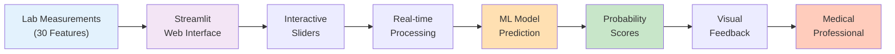

---

## Key Features

### 1. Interactive Input System

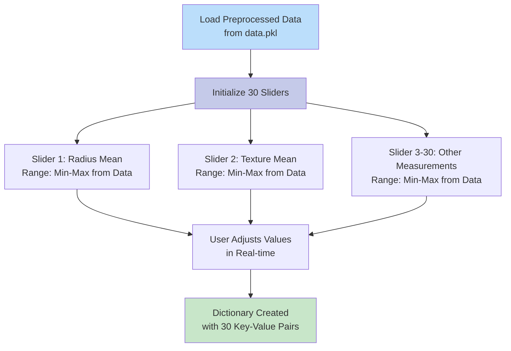

**Implementation Details:**
- 30 independent sliders in the left sidebar
- Each slider dynamically scaled to min/max values from the original dataset
- Default values set to dataset mean values
- Real-time updates trigger chart and prediction recalculation

### 2. Visual Analytics with Radar Charts

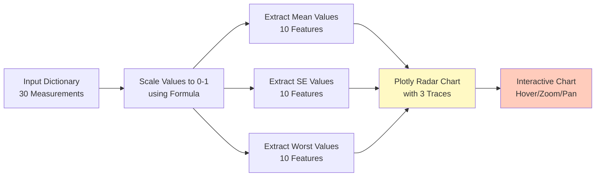

**Chart Features:**
- **3 Overlapping Traces:** Mean, Standard Error, and Worst values
- **10 Axes:** One for each measurement type (radius, texture, perimeter, etc.)
- **Scaling:** 0-1 range for normalized comparison
- **Interactivity:** Hover tooltips, zoom, pan, legend toggle

### 3. Machine Learning Prediction

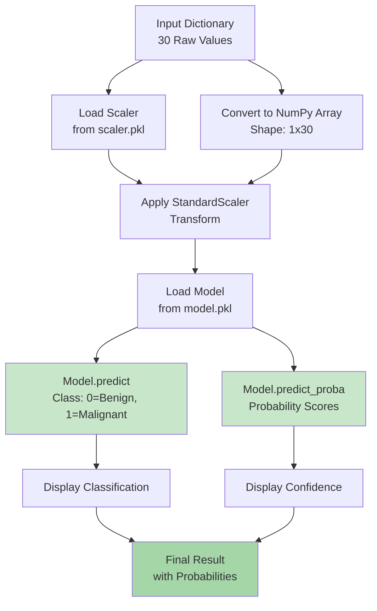

### 4. Color-Coded Diagnosis Display

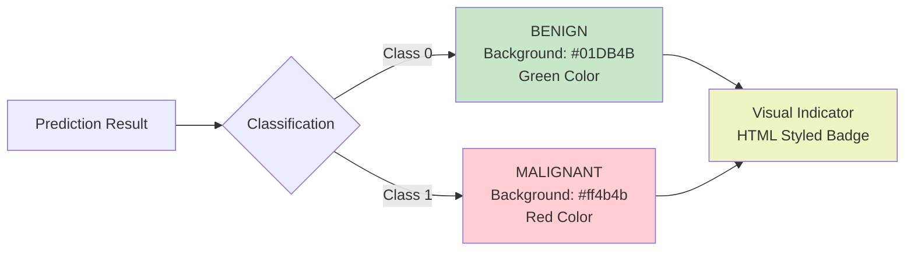

---

## Technology Stack

### Frontend & UI
| Technology | Version | Purpose |
|-----------|---------|---------|
| **Streamlit** | 1.36.0 | Web framework, UI rendering, real-time updates |
| **Plotly** | 5.22.0 | Interactive radar charts, data visualization |
| **HTML/CSS** | Custom | Styling diagnosis badges, layout customization |

### Backend & Data Processing
| Technology | Version | Purpose |
|-----------|---------|---------|
| **Python** | 3.8+ | Core language, business logic |
| **NumPy** | 2.0.0 | Array operations, numerical computations |
| **Pandas** | Latest | Data manipulation, DataFrame operations |
| **scikit-learn** | Latest | ML model, scaler, algorithms |

### Data Persistence
| Technology | Format | Purpose |
|-----------|--------|---------|
| **Pickle** | .pkl | Serialization of model, scaler, preprocessed data |

---

## Architecture & Design

### System Architecture Diagram

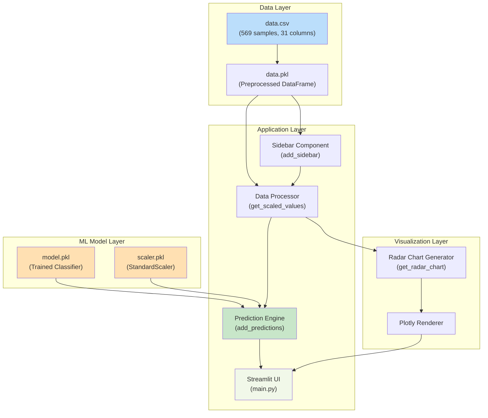

### Component Interaction Flow

```mermaid
sequenceDiagram
    participant User as Medical<br/>Professional
    participant UI as Streamlit<br/>Interface
    participant DataLayer as Data<br/>Layer
    participant ML as ML<br/>Engine
    participant Viz as Visualization

    User->>UI: Opens Application

    UI->>DataLayer: Load data.pkl
    DataLayer-->>UI: DataFrame (569 x 31)

    UI->>Viz: Initialize Page Config

    loop User Interaction
        User->>UI: Adjusts Slider

        par Parallel Processing
            UI->>DataLayer: Get slider ranges
            DataLayer-->>UI: Min/Max values
        and
            UI->>UI: Update input_dict
        end

        par Visualization Pipeline
            UI->>DataLayer: get_scaled_values()
            DataLayer-->>Viz: Scaled values 0-1
            Viz->>Viz: Generate 3-trace radar
            Viz-->>UI: Plotly figure
        and
            Parallel Prediction Pipeline
            UI->>ML: Load model.pkl
            UI->>ML: Load scaler.pkl
            ML->>ML: Transform input
            ML->>ML: predict_proba()
            ML-->>UI: [prob_benign, prob_malignant]
        end

        UI->>User: Display Chart + Prediction
    end
```

---

## Complete Application Flow

### High-Level Execution Flow

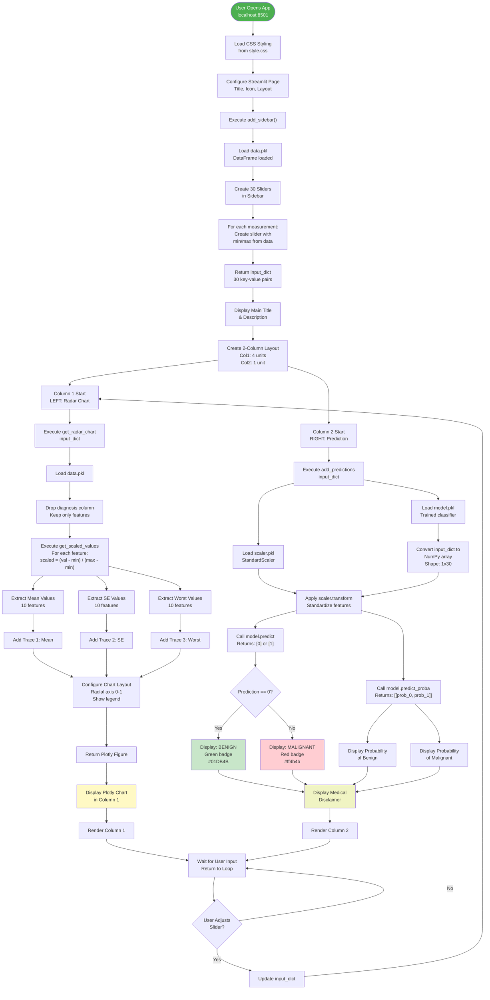

---

## Detailed Component Architecture

### 1. Sidebar Component (`add_sidebar()`)

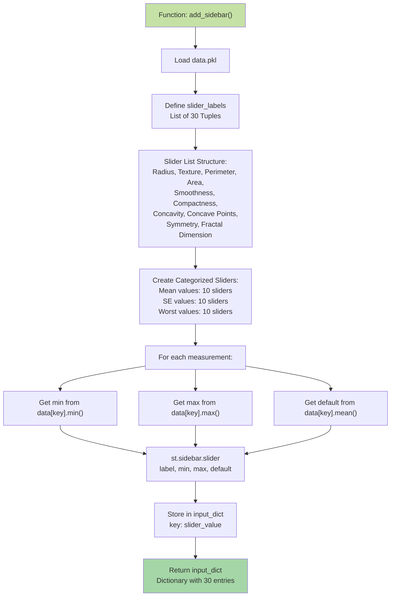

**Code Implementation:**
```python
def add_sidebar():
    st.sidebar.header("Cell Nuclei Measurements")
    data = pickle.load(open("data.pkl", "rb"))

    slider_labels = [
        ("Radius (mean)", "radius_mean"),
        ("Texture (mean)", "texture_mean"),
        # ... 28 more measurements
    ]

    input_dict = {}
    for label, key in slider_labels:
        input_dict[key] = st.sidebar.slider(
            label,
            min_value=float(data[key].min()),
            max_value=float(data[key].max()),
            value=float(data[key].mean()),
            key=key
        )
    return input_dict
```

**Key Points:**
- Dynamically scales sliders based on actual data ranges
- Prevents hardcoded 0-100 ranges that don't match feature distributions
- Default values set to dataset means for representative starting point

### 2. Scaling Function (`get_scaled_values()`)

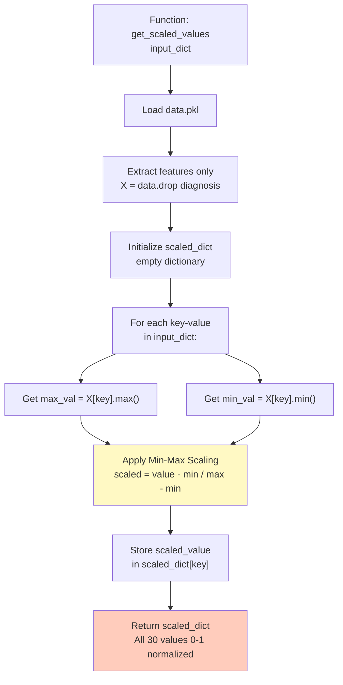

**Scaling Formula:**
```
scaled_value = (actual_value - min_value) / (max_value - min_value)
Result Range: [0, 1] (Perfect for radar chart visualization)
```

**Purpose:**
- Normalizes diverse feature scales to 0-1 for uniform visualization
- Enables comparison across different measurement types
- Required for radar chart interpretation

### 3. Radar Chart Generator (`get_radar_chart()`)

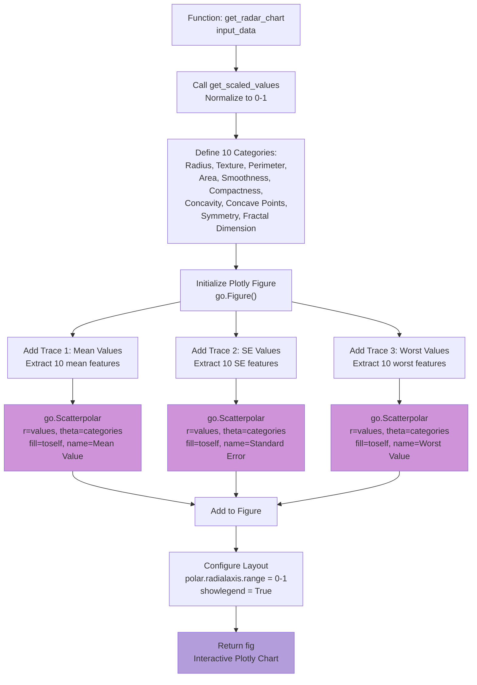

**Trace Structure:**
```
Trace 1 (Mean):          r = [radius_mean, texture_mean, ..., fractal_mean]
Trace 2 (SE):            r = [radius_se, texture_se, ..., fractal_se]
Trace 3 (Worst):         r = [radius_worst, texture_worst, ..., fractal_worst]
All Traces share θ axis: [Radius, Texture, Perimeter, Area, Smoothness, ...]
```

### 4. Prediction Engine (`add_predictions()`)

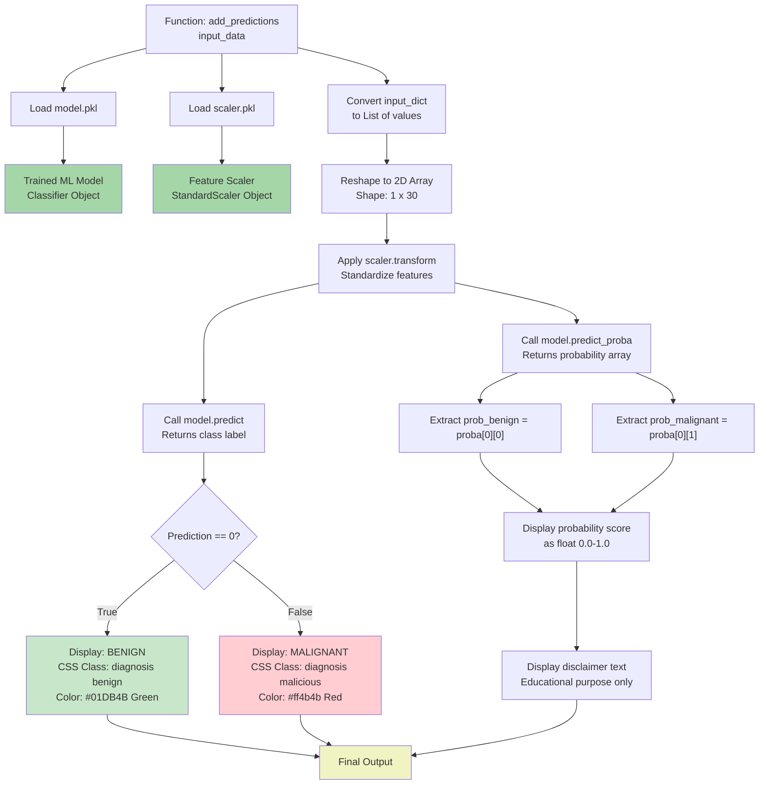

---

## Installation & Setup

### Prerequisites

- Python 3.8 or higher
- pip package manager
- 100MB disk space for dependencies

### Step-by-Step Installation

#### 1. Clone or Download Repository

```bash
git clone https://github.com/yourusername/breast-cancer-predictor.git
cd breast-cancer-predictor
```

#### 2. Create Virtual Environment (Recommended)

```bash
# Windows
python -m venv venv
venv\Scripts\activate

# macOS/Linux
python3 -m venv venv
source venv/bin/activate
```

#### 3. Install Dependencies

```bash
pip install -r requirements.txt
```

**Dependencies Breakdown:**

| Package | Version | Purpose |
|---------|---------|---------|
| numpy | 2.0.0 | Numerical computing |
| plotly | 5.22.0 | Interactive visualization |
| streamlit | 1.36.0 | Web framework |
| pandas | Latest | Data manipulation |
| scikit-learn | Latest | ML algorithms |

#### 4. Verify Installation

```bash
python -c "import streamlit; print(f'Streamlit {streamlit.__version__}')"
python -c "import plotly; print(f'Plotly {plotly.__version__}')"
```

#### 5. Verify Data Files

```bash
ls -lah *.pkl *.csv
# Should show:
# - data.pkl (preprocessed data)
# - model.pkl (trained model)
# - scaler.pkl (feature scaler)
# - data.csv (original dataset)
```

---

## Usage Guide

### Running the Application

```bash
streamlit run main.py
```

**Expected Output:**
```
  You can now view your Streamlit app in your browser.

  Local URL: http://localhost:8501
  Network URL: http://192.168.x.x:8501
```

### Application Interface

```
┌─────────────────────────────────────────────────────────────────────┐
│ Breast Cancer Predictor                                              │
│ ─────────────────────────────────────────────────────────────────── │
│                                                                     │
│ ┌──────────────────────────┐  ┌──────────────────────────────────┐ │
│ │                          │  │                                  │ │
│ │  SIDEBAR                 │  │  MAIN CONTENT                    │ │
│ │  ──────────────────────  │  │  ────────────────────────────── │ │
│ │                          │  │                                  │ │
│ │  Cell Nuclei             │  │  Radar Chart                     │ │
│ │  Measurements            │  │  ┌──────────────────────────┐   │ │
│ │  ────────────────────    │  │  │  /\                      │   │ │
│ │                          │  │  │ /  \                     │   │ │
│ │  ⊙ Radius (mean)         │  │  │ │ M │                    │   │ │
│ │  ═════════  [slider]     │  │  │ │ e │    Worst           │   │ │
│ │                          │  │  │ │ a │                    │   │ │
│ │  ⊙ Texture (mean)        │  │  │ └────┘                   │   │ │
│ │  ═════════  [slider]     │  │  │ SE = Standard Error      │   │ │
│ │                          │  │  └──────────────────────────┘   │ │
│ │  ⊙ Perimeter (mean)      │  │                                  │ │
│ │  ═════════  [slider]     │  │  Prediction Results              │ │
│ │                          │  │  ────────────────────────        │ │
│ │  ... (27 more)           │  │                                  │ │
│ │                          │  │  Cell Cluster Prediction:        │ │
│ │                          │  │  [BENIGN] or [MALIGNANT]        │ │
│ │                          │  │                                  │ │
│ │                          │  │  Prob Benign: 0.95              │ │
│ │                          │  │  Prob Malignant: 0.05           │ │
│ │                          │  │                                  │ │
│ │                          │  │  Disclaimer...                   │ │
│ └──────────────────────────┘  └──────────────────────────────────┘ │
└─────────────────────────────────────────────────────────────────────┘
```

### How to Use Step-by-Step

#### Step 1: Understand the Sidebar
```
The LEFT SIDEBAR contains 30 sliders:
- Row 1-10: MEAN values of each measurement
- Row 11-20: STANDARD ERROR values
- Row 21-30: WORST values
```

#### Step 2: Adjust Measurements
```
Click and drag sliders to input cell nuclei measurements:
- Slider automatically constrains value between min/max
- Real-time updates to chart and prediction
- Default values are dataset means
```

#### Step 3: Observe Radar Chart
```
The chart shows 3 overlapping polygons:
- Blue polygon = Mean values
- Red polygon = Standard Error
- Green polygon = Worst values
More extreme values = larger polygon area
```

#### Step 4: Check Prediction
```
RIGHT PANEL displays:
- Classification (green BENIGN or red MALIGNANT)
- Confidence score for each class
- Medical disclaimer
```

### Advanced Usage

#### Scenario 1: Testing Known Samples

1. Input measurements from lab tissue sample
2. Observe prediction confidence
3. Compare with clinical diagnosis for validation

#### Scenario 2: What-If Analysis

```
To analyze impact of changing a measurement:
1. Note initial prediction
2. Adjust ONE slider
3. Observe how chart and probabilities change
4. Understand feature importance
```

#### Scenario 3: Comparing Measurements

```
Use radar chart to visually compare:
- Mean vs Worst values (detect outliers)
- SE distribution (assess measurement uncertainty)
- Relative feature importance
```

---

## Project Structure & Files

### Directory Tree

```
breast-cancer-predictor/
│
├── main.py                     # Main Streamlit application (185 lines)
├── style.css                   # Custom CSS styling (19 lines)
├── requirements.txt            # Python dependencies (6 packages)
│
├── data.csv                    # Original dataset (569 samples x 31 columns)
├── data.pkl                    # Preprocessed data (binary pickle format)
├── model.pkl                   # Trained ML model (binary pickle format)
├── scaler.pkl                  # Feature scaler (binary pickle format)
│
├── BreastCancer.ipynb         # Jupyter notebook for training pipeline
│
├── .gitignore                  # Git configuration
└── README.md                   # Project documentation
```

### File Descriptions

#### main.py (Primary Application)
```python
# Lines 1-56: add_sidebar() function
# Purpose: Create 30 interactive sliders for measurements
# Returns: input_dict with 30 key-value pairs

# Lines 58-71: get_scaled_values() function
# Purpose: Normalize input values to 0-1 range for visualization
# Returns: scaled_dict with normalized values

# Lines 73-126: get_radar_chart() function
# Purpose: Generate 3-trace Plotly radar chart
# Returns: Plotly Figure object

# Lines 128-150: add_predictions() function
# Purpose: Load model, make prediction, display results
# Displays: Classification badge, probabilities, disclaimer

# Lines 154-184: main() function
# Purpose: Orchestrate UI layout and component rendering
```

#### style.css (Styling)
```css
/* Line 1-5: Sidebar styling */
.css-j5r0tf { padding, border-radius, background-color }

/* Line 7-11: Generic diagnosis badge */
.diagnosis { color, padding, border-radius }

/* Line 13-14: Benign diagnosis (Green) */
.diagnosis.benign { background-color: #01DB4B }

/* Line 17-18: Malignant diagnosis (Red) */
.diagnosis.malicious { background-color: #ff4b4b }
```

#### data.pkl (Preprocessed Data)
```
Format: Pickled Pandas DataFrame
Dimensions: 569 rows × 31 columns
Columns: [radius_mean, texture_mean, ..., diagnosis]
Data Types: float64 (features), object (diagnosis)
```

#### model.pkl (Trained Classifier)
```
Format: Pickled scikit-learn model
Type: Binary classification model
Input: 30 normalized features
Output: Class label (0=Benign, 1=Malignant)
Capabilities: predict(), predict_proba()
```

#### scaler.pkl (Feature Scaler)
```
Format: Pickled scikit-learn StandardScaler
Type: Feature normalization transformer
Input: Raw feature values
Output: Standardized features (mean=0, std=1)
Method: (x - mean) / std
```

---

## Machine Learning Pipeline

### Model Training Workflow

```mermaid
graph LR
    A["Load data.csv<br/>569 samples, 31 columns"] --> B["Exploratory Data<br/>Analysis"]
    B --> C["Check for<br/>Missing Values"]
    C --> D["Statistical<br/>Summary"]

    D --> E["Separate Features<br/>& Target"]
    E --> F["X = 30 features<br/>y = diagnosis"]

    F --> G["Train-Test<br/>Split"]
    G --> H["80% Train<br/>20% Test"]

    H --> I["Feature<br/>Scaling"]
    I --> J["StandardScaler<br/>transform(X_train, X_test)"]

    J --> K["Model<br/>Training"]
    K --> L["scikit-learn<br/>Algorithm"]

    L --> M["Hyperparameter<br/>Tuning"]
    M --> N["GridSearchCV<br/>Cross-validation"]

    N --> O["Model<br/>Evaluation"]
    O --> P["Metrics:<br/>Accuracy, Precision<br/>Recall, F1-Score"]

    P --> Q["Serialize<br/>Artifacts"]
    Q --> R["Save model.pkl"]
    Q --> S["Save scaler.pkl"]
    Q --> T["Save data.pkl"]

    style A fill:#bbdefb
    style K fill:#ffe0b2
    style Q fill:#c8e6c9
    style R fill:#a5d6a7
    style S fill:#a5d6a7
    style T fill:#a5d6a7
```

### Feature Engineering Overview

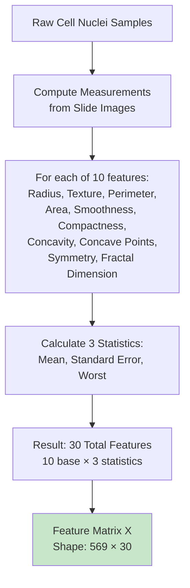

---

## Measurement Features Explained

### Feature Categories Matrix

```
┌─────────────┬────────────┬──────────────┬──────────────┐
│ Measurement │   Mean     │  Std Error   │    Worst     │
├─────────────┼────────────┼──────────────┼──────────────┤
│ Radius      │ radius_m   │ radius_se    │ radius_w     │
│ Texture     │ texture_m  │ texture_se   │ texture_w    │
│ Perimeter   │ perim_m    │ perim_se     │ perim_w      │
│ Area        │ area_m     │ area_se      │ area_w       │
│ Smoothness  │ smooth_m   │ smooth_se    │ smooth_w     │
│ Compactness │ compact_m  │ compact_se   │ compact_w    │
│ Concavity   │ concav_m   │ concav_se    │ concav_w     │
│ Concave Pts │ conc_p_m   │ conc_p_se    │ conc_p_w     │
│ Symmetry    │ symm_m     │ symm_se      │ symm_w       │
│ Fractal Dim │ frac_m     │ frac_se      │ frac_w       │
└─────────────┴────────────┴──────────────┴──────────────┘

Total: 30 Features
Sliders: 30 (one per feature)
```

### Detailed Feature Definitions

#### 1. RADIUS
```
Definition: Mean of distances from center to cell boundary
Unit: Micrometers (µm)
Range: Typically 6-35 µm
Interpretation: Larger radius = larger cell nucleus
Significance: Abnormal cells often have larger radii
```

#### 2. TEXTURE
```
Definition: Standard deviation of gray-scale pixel values
Unit: Unitless (image intensity variance)
Range: 10-40 (arbitrary units)
Interpretation: Higher = more irregular surface
Significance: Malignant cells show higher texture variation
```

#### 3. PERIMETER
```
Definition: Total distance around cell nucleus boundary
Unit: Micrometers (µm)
Range: 20-190 µm
Interpretation: Depends on size and shape
Significance: Perimeter = π × diameter for circles
```

#### 4. AREA
```
Definition: Number of pixels inside nucleus
Unit: Square micrometers (µm²)
Range: 50-2500 µm²
Interpretation: Total nucleus volume projection
Significance: Directly related to radius
```

#### 5. SMOOTHNESS
```
Definition: Local variation in radius lengths
Unit: Unitless (relative measure)
Range: 0.05-0.15
Interpretation: Measures boundary regularity
Significance: Malignant = less smooth boundaries
```

#### 6. COMPACTNESS
```
Definition: Perimeter² / Area - 1.0
Unit: Unitless (normalized shape measure)
Range: 0.04-0.35
Interpretation: Circle = low, spiky = high
Significance: Shape indicator of abnormality
```

#### 7. CONCAVITY
```
Definition: Severity of concave portions of contour
Unit: Unitless
Range: 0-0.43
Interpretation: 0 = smooth, high = many indentations
Significance: Malignant cells show higher concavity
```

#### 8. CONCAVE POINTS
```
Definition: Number of concave portions of contour
Unit: Count (integer)
Range: 0-15
Interpretation: Number of irregular boundary segments
Significance: Indicator of nuclear irregularity
```

#### 9. SYMMETRY
```
Definition: Symmetry of nucleus around center
Unit: Unitless (0-1 scale typically)
Range: 0.1-0.3
Interpretation: 0 = asymmetric, 1 = perfectly symmetric
Significance: Abnormal cells are less symmetric
```

#### 10. FRACTAL DIMENSION
```
Definition: "Coastline approximation" - 1
Unit: Unitless
Range: 0.04-0.10
Interpretation: Measures complexity of boundary
Significance: Fractal = self-similar at different scales
```

### Statistical Summary Table

```
Feature              Min     Max    Mean   StdDev   Distribution
──────────────────────────────────────────────────────────────────
radius_mean         6.98   28.11  14.13   3.52    Normal
texture_mean       9.71   39.28  19.29   4.30    Normal
perimeter_mean    43.79  188.50  91.97  24.30    Normal
area_mean        143.50 2501.00 654.89 361.91    Right-skewed
smoothness_mean    0.05    0.16   0.10   0.01    Normal
compactness_mean   0.02    0.35   0.10   0.05    Right-skewed
concavity_mean     0.00    0.43   0.09   0.08    Right-skewed
concave_points_m   0.00   15.00   4.27   3.42    Right-skewed
symmetry_mean      0.11    0.30   0.18   0.03    Normal
fractal_dim_mean   0.05    0.10   0.06   0.01    Normal
[Standard Error and Worst variants follow similar patterns]
```

---

## Data Processing Pipeline

### Complete Data Flow Diagram

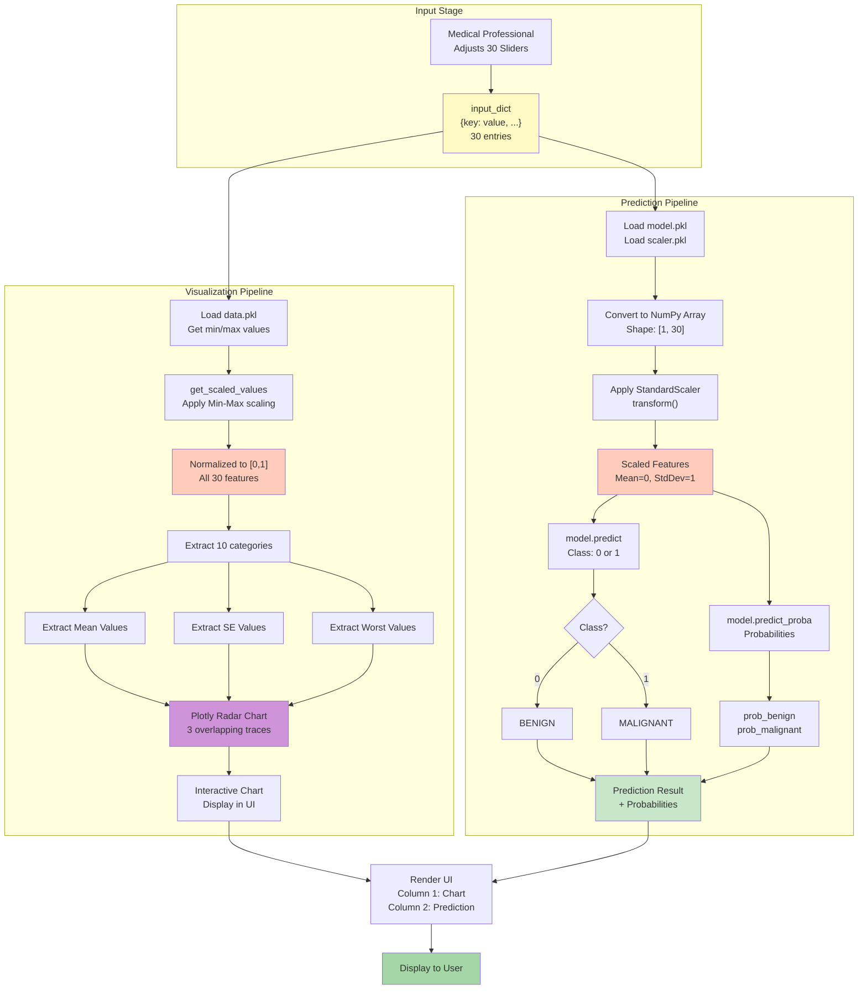

### Scaling Comparison

```
VALUE SCALING FOR VISUALIZATION:
Min-Max Normalization (0-1 range)
Formula: (value - min) / (max - min)

Example:
radius_mean: 6.98 → 35.98
Range: 6.98 to 28.11
If value = 14.13 (mean):
Scaled = (14.13 - 6.98) / (28.11 - 6.98) = 0.379

VALUE SCALING FOR PREDICTION:
StandardScaler (mean=0, std=1)
Formula: (value - mean) / std

Example:
radius_mean: mean=14.13, std=3.52
If value = 14.13:
Scaled = (14.13 - 14.13) / 3.52 = 0.0

Purpose difference:
- Min-Max: For visualization (needs 0-1)
- StandardScaler: For model input (center at 0)
```

---

## Code Functions Deep Dive

### Function 1: add_sidebar()

```python
def add_sidebar():
    """
    Creates interactive sidebar with 30 sliders for cell measurements.

    Process:
    1. Display sidebar header
    2. Load preprocessed data for min/max values
    3. Define 30 measurement labels
    4. Create sliders dynamically
    5. Return dictionary with user inputs

    Returns:
        dict: {feature_name: user_selected_value, ...}
              30 key-value pairs
    """
    st.sidebar.header("Cell Nuclei Measurements")
    data = pickle.load(open("data.pkl", "rb"))

    slider_labels = [
        ("Radius (mean)", "radius_mean"),
        ("Texture (mean)", "texture_mean"),
        # ... 28 more
    ]

    input_dict = {}

    for label, key in slider_labels:
        input_dict[key] = st.sidebar.slider(
            label,
            min_value=float(data[key].min()),
            max_value=float(data[key].max()),
            value=float(data[key].mean()),
            key=key  # Streamlit session state key
        )

    return input_dict
```

**Data Flow:**
```
data.pkl → Read into memory
Loop 30 times:
  ├─ Get slider label
  ├─ Get min from data
  ├─ Get max from data
  ├─ Get default from data mean
  └─ Create st.slider()
Return input_dict with 30 entries
```

### Function 2: get_scaled_values()

```python
def get_scaled_values(input_dict):
    """
    Normalizes input values to 0-1 range for radar chart visualization.

    Process:
    1. Load original data for min/max ranges
    2. Extract feature columns only
    3. For each input value:
       - Get min and max from original data
       - Apply min-max scaling formula
       - Store scaled value
    4. Return dictionary of scaled values

    Args:
        input_dict: {feature_name: raw_value, ...}

    Returns:
        dict: {feature_name: scaled_value_0_to_1, ...}
    """
    data = pickle.load(open("data.pkl", "rb"))
    X = data.drop(['diagnosis'], axis=1)

    scaled_dict = {}

    for key, value in input_dict.items():
        max_val = X[key].max()
        min_val = X[key].min()
        scaled_value = (value - min_val) / (max_val - min_val)
        scaled_dict[key] = scaled_value

    return scaled_dict
```

**Mathematical Formula:**
```
scaled = (value - min) / (max - min)

Example with radius_mean (min=6.98, max=28.11):
If value = 20.0
scaled = (20.0 - 6.98) / (28.11 - 6.98)
scaled = 13.02 / 21.13
scaled ≈ 0.616
```

### Function 3: get_radar_chart()

```python
def get_radar_chart(input_data):
    """
    Generates 3-trace Plotly radar chart.

    Process:
    1. Scale input values to 0-1
    2. Define 10 measurement categories
    3. Create Plotly figure
    4. Add Trace 1: Mean values
    5. Add Trace 2: Standard Error values
    6. Add Trace 3: Worst values
    7. Configure layout (axis range 0-1)
    8. Return figure

    Args:
        input_data: Raw input dictionary

    Returns:
        plotly.graph_objects.Figure: Interactive radar chart
    """
    input_data = get_scaled_values(input_data)

    categories = ['Radius', 'Texture', 'Perimeter', 'Area',
                  'Smoothness', 'Compactness',
                  'Concavity', 'Concave Points',
                  'Symmetry', 'Fractal Dimension']

    fig = go.Figure()

    # Trace 1: Mean values
    fig.add_trace(go.Scatterpolar(
        r=[input_data['radius_mean'], input_data['texture_mean'], ...],
        theta=categories,
        fill='toself',
        name='Mean Value'
    ))

    # Trace 2: Standard Error values
    fig.add_trace(go.Scatterpolar(
        r=[input_data['radius_se'], input_data['texture_se'], ...],
        theta=categories,
        fill='toself',
        name='Standard Error'
    ))

    # Trace 3: Worst values
    fig.add_trace(go.Scatterpolar(
        r=[input_data['radius_worst'], input_data['texture_worst'], ...],
        theta=categories,
        fill='toself',
        name='Worst Value'
    ))

    # Configure layout
    fig.update_layout(
        polar=dict(
            radialaxis=dict(
                visible=True,
                range=[0, 1]  # 0-1 scale for normalized data
            )),
        showlegend=True
    )

    return fig
```

**Trace Mapping:**
```
Categories (Axes):        Radius, Texture, Perimeter, Area, Smoothness,
                         Compactness, Concavity, Concave Points, Symmetry,
                         Fractal Dimension

Trace 1 (Mean):          r = [scaled_radius_mean, scaled_texture_mean, ...]
Trace 2 (SE):            r = [scaled_radius_se, scaled_texture_se, ...]
Trace 3 (Worst):         r = [scaled_radius_worst, scaled_texture_worst, ...]

All traces share same theta (axes) values
```

### Function 4: add_predictions()

```python
def add_predictions(input_data):
    """
    Loads ML model and generates prediction with probabilities.

    Process:
    1. Load model from pickle
    2. Load scaler from pickle
    3. Convert input_dict to NumPy array
    4. Apply feature scaling (StandardScaler)
    5. Make prediction (class 0 or 1)
    6. Get prediction probabilities
    7. Display results with styling
    8. Show medical disclaimer

    Args:
        input_data: Dictionary with 30 feature values

    Displays:
        - Classification (Benign/Malignant)
        - Probabilities for both classes
        - Medical disclaimer
    """
    model = pickle.load(open("model.pkl", "rb"))
    scaler = pickle.load(open("scaler.pkl", "rb"))

    # Convert dict to array
    input_array = np.array(list(input_data.values())).reshape(1, -1)
    # Shape: (1, 30)

    # Apply scaler
    input_array_scaled = scaler.transform(input_array)
    # Standardized: mean=0, std=1

    # Make prediction
    prediction = model.predict(input_array_scaled)
    # Returns: [0] or [1]

    # Display heading
    st.subheader("Cell cluster prediction")
    st.write("The cell cluster is:")

    # Display classification
    if prediction[0] == 0:
        st.write(
            "<span class='diagnosis benign'>Benign</span>",
            unsafe_allow_html=True
        )
    else:
        st.write(
            "<span class='diagnosis malicious'>Malignant</span>",
            unsafe_allow_html=True
        )

    # Get and display probabilities
    probabilities = model.predict_proba(input_array_scaled)[0]
    st.write(f"Probability of being benign: {probabilities[0]:.4f}")
    st.write(f"Probability of being malignant: {probabilities[1]:.4f}")

    # Display disclaimer
    st.write(
        "This app can assist medical professionals in making a diagnosis, "
        "but should not be used as a substitute for a professional diagnosis."
    )
```

**Prediction Array Format:**
```
Input:  input_array.shape = (1, 30)
        All 30 features in order

Output: prediction = [0]  or  [1]
        0 = Benign
        1 = Malignant

Output: probabilities = [[0.95, 0.05]]
        probabilities[0][0] = Prob Benign
        probabilities[0][1] = Prob Malignant
```

### Function 5: main()

```python
def main():
    """
    Main application orchestrator.

    Process:
    1. Configure Streamlit page (title, layout, sidebar)
    2. Load and inject custom CSS
    3. Create sidebar with input controls
    4. Render main title and description
    5. Create 2-column layout
    6. Column 1 (wide): Display radar chart
    7. Column 2 (narrow): Display predictions
    8. Continuous update on slider changes

    Layout:
    - Full width container: Title + description
    - 2-column split: 4:1 ratio
      ├─ Col 1: Radar chart (4 units)
      └─ Col 2: Prediction (1 unit)
    """
    # Configure page
    st.set_page_config(
        page_title="Breast Cancer Prediction",
        page_icon=":cancer:",
        layout="wide",
        initial_sidebar_state="expanded"
    )

    # Load CSS
    with open("style.css") as f:
        st.markdown(
            "<style>{}</style>".format(f.read()),
            unsafe_allow_html=True
        )

    # Get user input
    input_data = add_sidebar()

    # Title section
    with st.container():
        st.title("Breast Cancer Predictor")
        st.write(
            "Connect this app to your cytology lab for breast cancer diagnosis "
            "from tissue samples. Using a machine learning model, this app predicts "
            "whether a breast mass is benign or malignant based on lab measurements. "
            "You can also manually adjust the measurements using the sliders in the sidebar."
        )

    # 2-column layout
    col1, col2 = st.columns([4, 1])

    # Left column: Radar chart
    with col1:
        radar_chart = get_radar_chart(input_data)
        st.plotly_chart(radar_chart)

    # Right column: Predictions
    with col2:
        add_predictions(input_data)


if __name__ == '__main__':
    main()
```

---

## Visualization System

### Radar Chart Structure

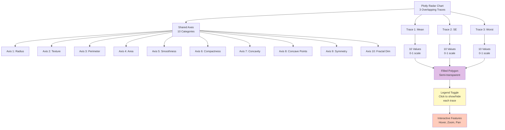

### Color Scheme

```css
/* CSS Classes and Colors */

.diagnosis {
    color: white,
    padding: 0.2em 0.5em,
    border-radius: 0.5em
}

.diagnosis.benign {
    background-color: #01DB4B  /* Bright Green */
    Text: White
}

.diagnosis.malicious {
    background-color: #ff4b4b  /* Bright Red */
    Text: White
}

/* Sidebar Styling */
.css-j5r0tf {
    padding: 1rem
    border-radius: 0.5rem
    background-color: #7E99AB  /* Steel Blue */
}
```

---

## Prediction Engine

### Classification Logic

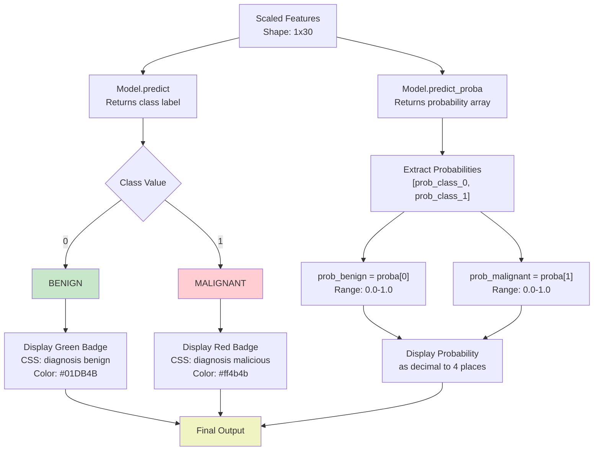

### Confidence Score Interpretation

```
Probability Range Analysis:

0.50 - 0.60: Low Confidence
├─ Model uncertain
└─ Requires additional review

0.60 - 0.75: Medium Confidence
├─ Leaning toward diagnosis
└─ Reasonable confidence level

0.75 - 0.85: High Confidence
├─ Strong model agreement
└─ Good support for diagnosis

0.85 - 1.00: Very High Confidence
├─ Model very confident
└─ Strong classification signal
```

---

## Contributing Guidelines

### Development Setup

```bash
# 1. Fork repository
git clone https://github.com/yourusername/breast-cancer-predictor.git

# 2. Create feature branch
git checkout -b feature/your-feature-name

# 3. Create virtual environment
python -m venv venv
source venv/bin/activate  # Windows: venv\Scripts\activate

# 4. Install dependencies
pip install -r requirements.txt

# 5. Make changes
# Edit files, test locally

# 6. Run application
streamlit run main.py

# 7. Commit changes
git add .
git commit -m "Add: feature description"
git push origin feature/your-feature-name

# 8. Create Pull Request
```

### Code Style Guidelines

- Follow PEP 8 Python style guide
- Use meaningful variable names
- Add docstrings to functions
- Keep lines under 100 characters
- Use type hints where applicable

### Areas for Contribution

```
Priority Improvements:
├─ Model enhancements
│  ├─ Try different algorithms
│  ├─ Hyperparameter optimization
│  └─ Feature engineering
│
├─ UI/UX improvements
│  ├─ Additional visualizations
│  ├─ Mobile responsiveness
│  └─ Accessibility features
│
├─ Performance optimization
│  ├─ Caching mechanisms
│  ├─ Lazy loading
│  └─ Database integration
│
└─ Documentation
   ├─ API documentation
   ├─ Deployment guides
   └─ Troubleshooting guides
```

---

## Medical Disclaimer

**CRITICAL NOTICE TO USERS**

```
⚠️ THIS APPLICATION IS NOT A MEDICAL DEVICE ⚠️

This application is designed for EDUCATIONAL AND RESEARCH PURPOSES ONLY.

USE LIMITATIONS:
✗ NOT a substitute for professional medical diagnosis
✗ NOT approved for clinical decision-making
✗ NOT intended to replace pathologist review
✗ NOT a FDA-cleared diagnostic tool

PROPER USAGE:
✓ Use as supplementary decision support
✓ Consult qualified healthcare providers
✓ Perform proper medical examinations
✓ Combine with clinical judgment
✓ Document all decisions made

DISCLAIMER:
The developers assume NO LIABILITY for:
- Medical decisions based on this application
- Patient outcomes resulting from predictions
- Incorrect diagnoses or missed diagnoses
- Damage resulting from application errors

By using this application, you acknowledge:
1. You understand the limitations
2. You will not rely on this as sole diagnostic tool
3. You have proper medical credentials to interpret results
4. You take full responsibility for clinical decisions

MEDICAL PROFESSIONALS:
If you are a healthcare provider using this tool, you maintain
full responsibility for patient care decisions, diagnostics,
and treatment plans.
```

---

## License

This project is licensed under the **MIT License**.

```
MIT License

Copyright (c) 2024 Breast Cancer Predictor Contributors

Permission is hereby granted, free of charge, to any person obtaining a copy
of this software and associated documentation files (the "Software"), to deal
in the Software without restriction, including without limitation the rights
to use, copy, modify, merge, publish, distribute, sublicense, and/or sell
copies of the Software, and to permit persons to whom the Software is
furnished to do so, subject to the following conditions:

The above copyright notice and this permission notice shall be included in all
copies or substantial portions of the Software.

THE SOFTWARE IS PROVIDED "AS IS", WITHOUT WARRANTY OF ANY KIND, EXPRESS OR
IMPLIED, INCLUDING BUT NOT LIMITED TO THE WARRANTIES OF MERCHANTABILITY,
FITNESS FOR A PARTICULAR PURPOSE AND NONINFRINGEMENT. IN NO EVENT SHALL THE
AUTHORS OR COPYRIGHT HOLDERS BE LIABLE FOR ANY CLAIM, DAMAGES OR OTHER
LIABILITY, WHETHER IN AN ACTION OF CONTRACT, TORT OR OTHERWISE, ARISING FROM,
OUT OF OR IN CONNECTION WITH THE SOFTWARE OR THE USE OR OTHER DEALINGS IN THE
SOFTWARE.
```

---

## Support & Resources

### Getting Help

```
Documentation:
├─ README.md (this file)
├─ Code comments in main.py
└─ Function docstrings

Questions & Issues:
├─ GitHub Issues: Report bugs
├─ GitHub Discussions: Ask questions
└─ Documentation: Consult guides

External Resources:
├─ Streamlit Docs: https://docs.streamlit.io/
├─ Plotly Docs: https://plotly.com/python/
├─ scikit-learn Docs: https://scikit-learn.org/
└─ Dataset Info: UCI Machine Learning Repository
```

### Troubleshooting

```
Problem: "ModuleNotFoundError: No module named 'streamlit'"
Solution: pip install -r requirements.txt

Problem: "FileNotFoundError: data.pkl not found"
Solution: Ensure all .pkl files are in same directory as main.py

Problem: Sliders show NaN values
Solution: Check data.pkl integrity, regenerate if needed

Problem: Chart not displaying
Solution: Check Plotly installation, update with pip install --upgrade plotly

Problem: Slow prediction response
Solution: Model is fast; check system resources, restart application
```

---

## Acknowledgments

### Data Source

- **Dataset**: Wisconsin Breast Cancer Dataset (Diagnostic)
- **Samples**: 569 tissue samples
- **Features**: 30 computed characteristics
- **Classes**: 2 (Benign, Malignant)
- **Institution**: University of Wisconsin Hospitals, Madison
- **Creators**: Dr. William H. Wolberg, W. Nick Street, Olvi L. Mangasarian
- **Source**: UCI Machine Learning Repository

### Libraries & Tools

- **Streamlit**: Web application framework
- **Plotly**: Interactive visualization library
- **scikit-learn**: Machine learning algorithms
- **NumPy**: Numerical computing
- **Pandas**: Data manipulation

### References

1. Wolberg, W. H., Street, W. N., & Mangasarian, O. L. (1995). Machine learning techniques to diagnose breast cancer.
2. [UCI ML Repository - Breast Cancer Wisconsin](https://archive.ics.uci.edu/ml/datasets/Breast+Cancer+Wisconsin+(Diagnostic))
3. [Streamlit Documentation](https://docs.streamlit.io/)
4. [Plotly Python Reference](https://plotly.com/python/)

---

## Version History

```
v1.0.0 (Current)
├─ Initial release
├─ 30 interactive sliders
├─ 3-trace radar chart visualization
├─ ML-based prediction
├─ Probability scores
└─ Color-coded diagnosis display

Future Versions:
├─ v1.1: Batch prediction from CSV
├─ v1.2: Prediction history/logging
├─ v1.3: REST API endpoint
├─ v2.0: Database integration
└─ v2.1: Mobile app version
```

---

## Roadmap

```
Q1 2025:
├─ Add SHAP model explainability
├─ Implement prediction caching
└─ Create API documentation

Q2 2025:
├─ Add batch CSV upload
├─ Create REST API
└─ Database integration

Q3 2025:
├─ Mobile application
├─ Advanced visualizations
└─ User authentication

Q4 2025:
├─ Multi-model ensemble
├─ Real-time monitoring
└─ Production deployment
```

---

<div align="center">

**Developed with dedication for advancing diagnostic precision**

Made to assist medical professionals in making informed decisions about breast cancer diagnosis.

[Report Issues](https://github.com/yourusername/breast-cancer-predictor/issues) • [Request Features](https://github.com/yourusername/breast-cancer-predictor/issues) • [Documentation](https://github.com/yourusername/breast-cancer-predictor)

**Disclaimer**: This application is for educational and research purposes only. Always consult qualified healthcare professionals for medical decisions.

</div>
